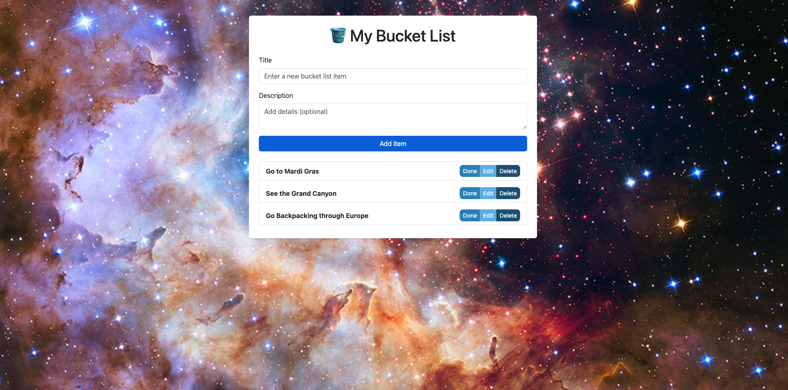

# 🪣 Bucket List Web App

A simple, interactive Bucket List application to help you track your life goals. Built with Spring Boot, PostgreSQL, HTML/CSS, and JavaScript, this app lets you add, edit, mark complete, and delete bucket list items.

The UI features a starry night background and blue-themed buttons for a polished look.

---

## Why This Matters

Many people have goals and dreams, but keeping track of them can be challenging. This app helps by:

- **Organizing your goals** in one place.
- **Tracking progress** by marking items as completed.
- **Allowing flexibility** to edit or remove items.
- **Making goal tracking visually appealing and motivating**.

---

## Features

- Add new bucket list items with **title** and optional **description**.
- Mark items as **Done/Undo** with a **strikethrough** effect for completed items.
- **Edit** existing items.
- **Delete** items.
- Responsive design for desktop and mobile.
- Custom blue-themed buttons to match a starry background.

---

## How to Use

1. Open the app in your browser at `http://localhost:8080`.
2. **Add a new item**: enter a title, optionally add a description, then click **Add Item**.
3. **Manage items**:
    - **Done/Undo**: toggle completion (strikethrough applied).
    - **Edit**: update title or description.
    - **Delete**: remove the item.
4. **Visual cues**: completed items appear grayed out with a strikethrough, and buttons are shades of blue.

---

## Tech Stack

- **Backend:** Spring Boot (Java 25)
- **Database:** PostgreSQL
- **Frontend:** HTML, CSS, JavaScript
- **ORM:** Spring Data JPA / Hibernate
- **Build Tool:** Maven
- **Styling:** Bootstrap 5.3 + custom CSS
- **Version Control:** Git

---

## Setup & Run

### 1. Clone the repository
    git clone <https://github.com/SarahBorgelt/BucketList.git>

### 2. Configure PostgreSQL
In the application.properties (src/main/resources/application.properties) file,
update the datasource password to your PostgreSQL password and ensure that the 
database exists on your machine. 

### 3. Start the application
**macOS/Linux:** Double-click the startBucketList.command file in the project folder to launch the app in a terminal.

**Windows:** Double-click the startBucketList.bat file to launch the app.

### 4. The app will start on http://localhost:8080

